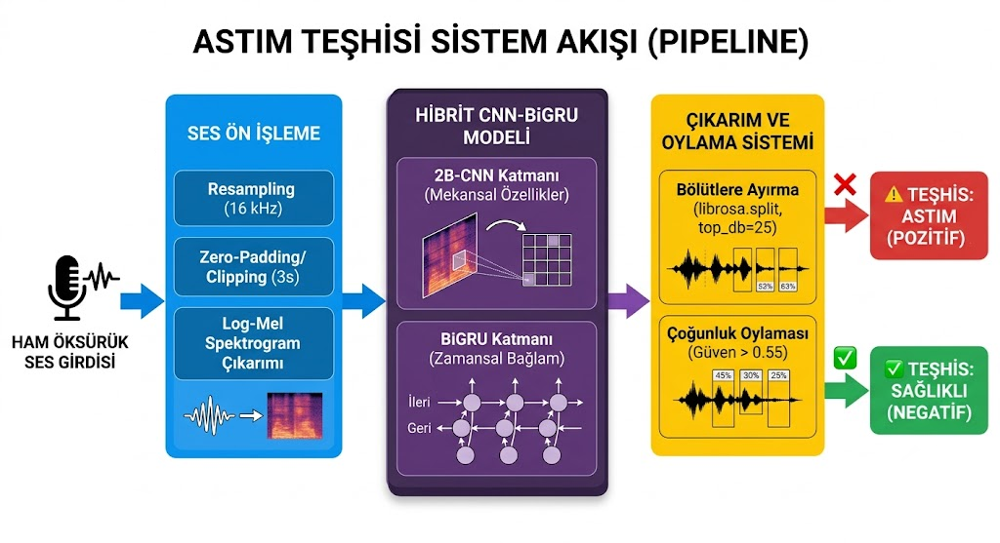
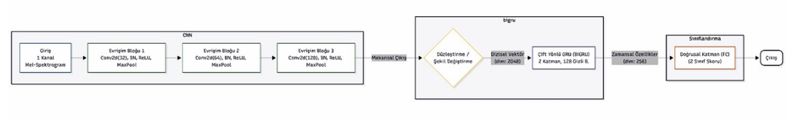
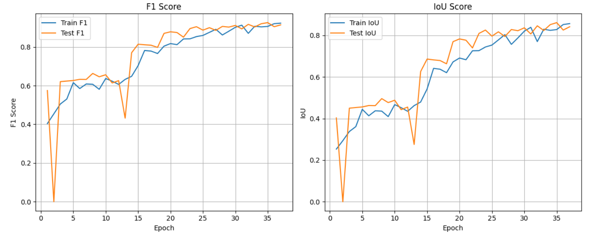

# CNN-BiGRU Mimarisi ile Ses Analizi Tabanlı Astım Teşhisi

Bu proje, öksürük ses kayıtlarından astım semptomlarını otomatik olarak tespit etmek amacıyla geliştirilmiş uçtan uca bir derin öğrenme (DL) sistemidir. Sistem, Mel-Spektrogramlar üzerinden uzamsal özellikleri çıkaran **2B-CNN** ile zamansal bağlamı modelleyen **Bi-GRU** mimarilerini birleştiren hibrit bir yapıya sahiptir.

---

## Sistem Akışı ve Model Mimarisi

Sistem akışı şu sıralamayı takip eder: Ses Girdisi ➔ 16 kHz Örnekleme ➔ Enerji Tabanlı Bölütleme (Librosa) ➔ Sabit Pencereleme (3s) ➔ Mel-Spektrogram Dönüşümü ➔ Hibrit Model İşleme ➔ Çoğunluk Oylaması ➔ Teşhis (`Astım` veya `Sağlıklı`).

### Model Katmanları:
* **CNN Bloğu:** Mekansal özellikleri yakalamak için 3 adet ardışık Conv2D katmanı (katman başına sırasıyla 32, 64 ve 128 filtre), her katmanda Yığın Normalizasyonu (BatchNorm2d), ReLU aktivasyonu, MaxPool2d (2x2) ve sırasıyla 0.1, 0.1, 0.2 olasılıklı Dropout2d katmanları.
* **Bi-GRU Bloğu:** Zamansal bağımlılıkları ve dizilimleri öğrenmek için 2 katmanlı, 128 gizli düğümlü (hidden size), batch_first=True ve 0.3 seyreltme (dropout) oranına sahip çift yönlü GRU (BiGRU).
* **Sınıflandırma Katmanı:** 0.3 olasılıklı Dropout ile korunan ve nihai kararı üreten 256 boyutlu girişli doğrusal (Linear) katman.

---

## Eğitim Ayarları ve Başarım Bulguları

Modelin eğitimi, toplam **1.144 ses dosyası** (667 sağlıklı, 477 astım) içeren veri seti üzerinden %20 test oranıyla ayrılmış Train (915) ve Test (229) loader'ları ile PyTorch üzerinde gerçekleştirilmiştir.

### Hiperparametreler:
* **Giriş Uzunluğu:** 3 Saniye (16 kHz örnekleme hızında 48.000 örnek).
* **Spektrogram:** 128 Mel frekansı, n_fft = 1024, hop_length = 512.
* **Optimizasyon:** Adam (Learning Rate: 0.0005, Weight Decay: 1e-4).
* **Öğrenme Oranı Zamanlayıcı:** Mode='min', factor=0.5, patience=3 özelliklerine sahip ReduceLROnPlateau.
* **Erken Durdurma:** 7 Epoch sabır (Patience) [Maksimum 40 Epoch].

### Performans Sonuçları:
Model, 30. epoch'ta en iyi değerlerine ulaşmış ve 37. epoch'ta erken durdurma mekanizmasının devreye girmesiyle eğitimi tamamlamıştır. Kaydedilen en iyi model ağırlıklarının test verisi performansı şu şekildedir:

* **En İyi Test Kaybı (Loss):** `0.1809`.
* **Test Doğruluğu (Accuracy):** `%92.58`.
* **F1 Skoru (Dice):** `0.911`.
* **IoU Skoru (Jaccard):** `0.837`.

## Çıkarım (Inference) ve Oylama Sistemi
Tek bir ses dosyası körü körüne sınıflandırılmak yerine `librosa.effects.split` ile sessiz kısımlarından temizlenerek bölütlere ayrılır. Güven oranı `%55` (`0.55`) üzerinde olan segmentler oylamaya dahil edilerek çoğunluk kararı ile nihai teşhis koyulur.
